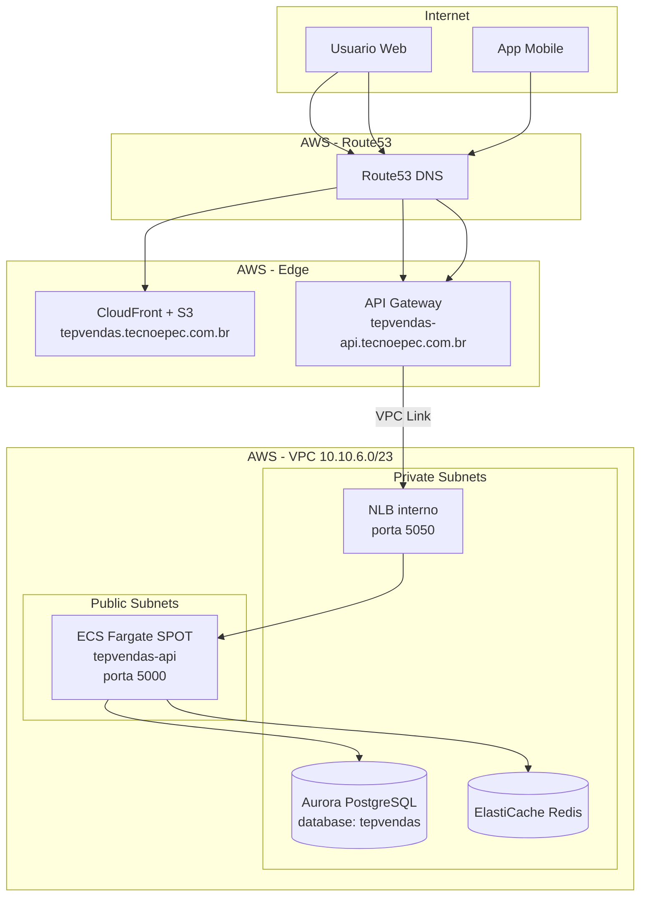

# Visao Geral da Arquitetura

## Diagrama de Infraestrutura

## Componentes

### Backend API (.NET 10)

- **Padrao**: Clean Architecture (Domain → Service → Data)
- **ORM**: Entity Framework Core com PostgreSQL (Npgsql)
- **Cache**: Redis via StackExchange.Redis
- **Auth**: JWT Bearer (access token 15min + refresh token 7 dias)
- **Multi-tenancy**: CompanyId em todas as entidades (BaseEntity)
- **API**: REST, versionada (`/tepsales/v1/...`)

### Frontend Web (Next.js 14)

- **UI**: Material-UI (MUI v5) com theme customizado
- **State**: TanStack React Query para server state
- **Forms**: React Hook Form + Yup validation
- **Deploy**: Static export → S3 + CloudFront (SPA)

### Mobile (Flutter 3)

- **State**: Riverpod
- **HTTP**: Dio
- **Offline**: SQLite + Hive (offline-first)
- **Push**: Firebase Cloud Messaging
- **Sync**: Incremental sync com backend

## Recursos Compartilhados (TecnoePec)

O TepVendas compartilha infraestrutura com outros produtos da TecnoePec:

| Recurso | Detalhes |
|---------|----------|
| VPC | `10.10.6.0/23`, 2 AZs (us-east-1a, us-east-1b) |
| ECS Cluster | "main" (compartilhado com TepConfina, EFATAH, etc.) |
| NLB | "main" interno (cada servico usa porta diferente) |
| Aurora PostgreSQL | Cluster serverless v2, database separado por produto |
| ElastiCache Redis | Cluster compartilhado `tecnoepec` |
| ACM Certificate | `*.tecnoepec.com.br` |
| VPC Link | "main-vpc-link" (API Gateway → NLB) |

## Portas NLB

| Porta | Servico |
|-------|---------|
| 3000 | BrandBrain Web |
| 5000 | TepConfina API |
| 5002 | EnerSync API |
| 5003 | BrandBrain API |
| **5050** | **TepVendas API** |
| 6000-6002 | LegalTech |
| 6050 | EFATAH API |
