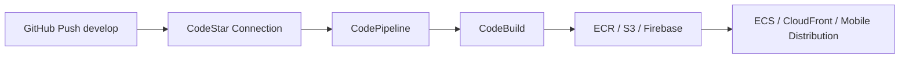

# CI/CD

Toda a esteira de CI/CD do TEP Vendas roda na **AWS CodePipeline + CodeBuild**.

## Visão Geral



| Componente | Backend | Frontend | Mobile |
|------------|---------|----------|--------|
| **Repo** | `TecnoePec/tep_vendas_services` | `TecnoePec/tep_vendas_backoffice` | `TecnoePec/tep_vendas_mobile` |
| **Branch** | develop | develop | develop |
| **Pipeline** | `development-tepvendas-api-pipeline` | `development-tepvendas-web-pipeline` | `development-tepvendas-mobile-pipeline` |
| **CodeBuild** | `development-tepvendas-api-build` | `development-tepvendas-web-build` | `development-tepvendas-mobile-build` |
| **Artefato final** | Imagem Docker no ECR | Static export no S3 | APK no Firebase App Distribution |
| **Buildspec** | `buildspec.yml` na raiz do repo | `buildspec.yml` na raiz do repo | `buildspec.yml` na raiz do repo |

## Backend (.NET 10)

**Trigger:** Push para `develop`

**Estágios:**

1. **Source** — CodeStar connection `tepconfina-github` puxa o código
2. **Build** — CodeBuild executa `buildspec.yml`:
    - `dotnet restore` + `dotnet build`
    - `dotnet test` (765 testes)
    - Docker build da imagem
    - Push para ECR `development-tepvendas-api`
3. **Migrations** — Step rodando `dotnet ef database update` contra o Aurora
4. **Deploy** — Atualiza task definition + force-new-deployment no ECS service `tepvendas-api`

## Frontend (Next.js 14)

**Trigger:** Push para `develop`

**Estágios:**

1. **Source** — CodeStar connection puxa o código
2. **Build** — CodeBuild:
    - `npm ci`
    - `npm run lint` + `npm test` (1173 testes)
    - `npm run build` (static export)
3. **Deploy:**
    - `aws s3 sync out/` para `development-tepvendas-web-005200801295`
    - `aws cloudfront create-invalidation` para `E3NF0XZGA0HAJ5`

## Mobile (Flutter)

**Trigger:** Push para `develop`

**Estágios:**

1. **Source** — CodeStar connection puxa o código
2. **Build** — CodeBuild (imagem `aws/codebuild/amazonlinux2-x86_64-standard:5.0`):
    - Instala Flutter na versão travada `FLUTTER_VERSION=3.38.9` (revalida cache — re-clona se drift)
    - Instala Android SDK (command-line tools + platforms `android-34` + build-tools `34.0.0`) em `/opt/android-sdk`
    - `flutter pub get`
    - `flutter analyze --no-fatal-infos --no-fatal-warnings`
    - `flutter test`
    - `flutter build apk --release --dart-define=ENV=production`
    - `flutter build appbundle --release --dart-define=ENV=production`
3. **Distribute** — `firebase appdistribution:distribute` envia APK para Firebase App Distribution (falha marcada como não-bloqueante enquanto a auth Firebase não está configurada no CodeBuild).

!!! warning "Versão do Flutter travada"
    O buildspec clona `flutter/flutter@$FLUTTER_VERSION` em vez do canal `stable`. Isso evita drift silencioso — um incidente anterior (`_ElevatedButtonWithIcon` renomeado internamente em versão nova do SDK) quebrou o build sem que nada tivesse mudado no repo.

!!! tip "Cache do CodeBuild"
    `/opt/flutter/**`, `/opt/android-sdk/**`, `.dart_tool/**` e `.pub-cache/**` são cacheados no S3 do projeto. Primeira execução dura ~15-25min (baixa SDKs), próximas caem pra ~5-8min.

## Configurações

### Connection GitHub

A connection `tepconfina-github` (CodeStar/CodeConnections) precisa ter acesso aos 3 repos do TEP Vendas no GitHub App `AWS Connector for GitHub`.

### Buildspec

Cada repo tem um `buildspec.yml` na raiz, gerenciado pela equipe da aplicação. A infra compartilhada (CodePipeline, CodeBuild, S3 buckets, IAM roles) está em:

```
infrastructure/aws/account/tecnoepec/tepvendas/cicd/
```

### Permissões

CodeBuild assume a role `development-tepvendas-{api|web|mobile}-codebuild-role` com permissões para:

- Pull/push no ECR
- Read em Secrets Manager
- Update em ECS task definitions
- Sync em S3 e invalidate em CloudFront
- Acesso ao Firebase App Distribution (mobile)

## Monitoramento

Status dos pipelines:

```bash
aws codepipeline list-pipeline-executions \
  --pipeline-name development-tepvendas-api-pipeline \
  --profile tecnoepec-dev --region us-east-1
```

Logs do CodeBuild aparecem no CloudWatch em `/aws/codebuild/development-tepvendas-{api|web|mobile}-build`.

## Histórico

- **mar/2026** — Migração de GitHub Actions para AWS CodePipeline (limite de minutos do GitHub Actions atingido)
- **ago/2026** — Workflows `.github/workflows/*.yml` **removidos** dos repos backend e mobile — deploy é 100% CodePipeline; os workflows redundantes só geravam notificações falsas (build iOS sem ambiente configurado).
- **ago/2026** — Buildspec mobile passou a instalar Android SDK explicitamente + travar Flutter version (era `stable`, agora `3.38.9`) — fix definitivo do "No Android SDK found" e do drift do canal stable.
