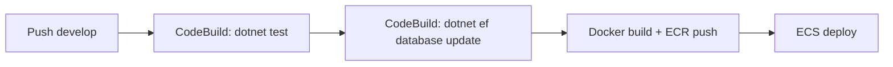

# Migrations

O TEP Vendas usa **Entity Framework Core 10** com PostgreSQL (Npgsql 10) para gerenciamento de schema.

## Onde rodam as migrations

As migrations rodam no **CI/CD**, não no startup do container. Isso evita que múltiplas tasks ECS tentem migrar simultaneamente e que o container caia se o banco estiver desligado.

### Fluxo no pipeline



A etapa `dotnet ef database update` está no `buildspec.yml` do `tep_vendas_services`, antes do build da imagem Docker.

## Comandos locais

### Criar uma nova migration

```bash
cd tep_vendas_services
dotnet ef migrations add NomeDaMigration \
    --project src/Tep.Sales.Service.Data \
    --startup-project src/Tep.Sales.Service.Host \
    --context AppDbContext
```

### Aplicar migrations localmente

```bash
dotnet ef database update \
    --project src/Tep.Sales.Service.Data \
    --startup-project src/Tep.Sales.Service.Host
```

### Reverter última migration

```bash
dotnet ef migrations remove \
    --project src/Tep.Sales.Service.Data \
    --startup-project src/Tep.Sales.Service.Host
```

## Connection String

A connection string vem de:

- **Local:** `appsettings.Development.json` ou variável `POSTGRESQL_CONNECTION`
- **Produção (ECS):** Secret `development.TEPVENDAS_CONNECTION_STRING` mapeado para a env var `POSTGRESQL_CONNECTION`

Formato:

```
Host=tecnoepec-development.cluster-cqbg6cm8wurp.us-east-1.rds.amazonaws.com;
Port=5432;
Database=tepvendas;
Username=tepconfina_admin;
Password=...;
SSL Mode=Require;
Trust Server Certificate=true
```

!!! warning "Senha do Aurora rotaciona"
    A senha do Aurora é gerenciada por `ManageMasterUserPassword`. Quando rotaciona, o secret `development.TEPVENDAS_CONNECTION_STRING` precisa ser sincronizado a partir do RDS managed secret.

## Multi-tenancy

Todas as entidades que herdam de `BaseEntity<Guid>` têm `CompanyId` e um Global Query Filter aplicado em `AppDbContext.OnModelCreating()`:

```csharp
modelBuilder.Entity<TEntity>()
    .HasQueryFilter(e => _tenantId == null || e.CompanyId == _tenantId);
```

Quando uma migration cria uma nova tabela com `BaseEntity`, o filtro é adicionado automaticamente.

## Convenções

- **Nome da migration:** PascalCase descritivo (ex: `AddFreightConversionFactor`)
- **Nome de tabela:** snake_case (ex: `freight_tables`)
- **Nome de coluna:** PascalCase (ex: `InitialKilometer`)
- **Soft delete:** via campo `Status` no enum (não via `IsDeleted`)

## Tratamento de DateTime (Npgsql 10)

O Npgsql 10 não aceita `DateTime` com `Kind=Unspecified`. Por isso, há um `ValueConverter` aplicado a todas as propriedades `DateTime` em `AppDbContext.OnModelCreating()`:

```csharp
property.SetValueConverter(
    new ValueConverter<DateTime, DateTime>(
        v => v.Kind == DateTimeKind.Unspecified
            ? DateTime.SpecifyKind(v, DateTimeKind.Utc)
            : v.ToUniversalTime(),
        v => DateTime.SpecifyKind(v, DateTimeKind.Utc)));
```

## Tabelas (37)

Estrutura completa em [`tep_vendas_services_db_diagram.md`](https://github.com/TecnoePec/tepvendas-docs/blob/main/tep_vendas_services_db_diagram.md) na raiz do repo.

Principais grupos:

- **Identity:** users, refresh_tokens, push_tokens, companies
- **Catálogo:** products, product_groups, product_lines
- **Comercial:** clients, addresses, distribuition_centers
- **Pricing:** price_tables, payment_price_tables, price_table_items, price_table_unloadings
- **Frete:** freight_tables, freight_compositions, freight_conversion_factors
- **Vendas:** purchase_orders, purchase_order_items, purchase_order_histories
- **Comissões/Descontos:** commissions, discount_rules, discount_weights
- **Operacional:** notifications, audit_logs, deleted_entities, integration_*, templates, vehicle_types
