# Diagrama de Banco de Dados — TEP Vendas Services

> **37 tabelas** | PostgreSQL 17 (Aurora Serverless v2) | EF Core 10 | Multi-tenant por `CompanyId`
>
> Todas as tabelas herdam de `BaseEntity`: `Id (uuid PK)`, `CreatedAt`, `UpdatedAt`, `UserCreated`, `UserUpdated`, `CompanyId`, `OwnerId`
>
> Feature-flags por empresa (CIF/FOB, discount por budget, self-registration) vivem em `company_global_parameters` — **não** em `companies`.

---

## Diagrama ER

```mermaid
erDiagram

    %% ═══════════════════════════════════════
    %% CORE / MULTI-TENANCY
    %% ═══════════════════════════════════════

    companies {
        uuid Id PK
        varchar Name
        varchar Document
        bool IsActive
        datetime ExpiresAt "nullable"
    }

    %% Feature-flags foram movidas pra company_global_parameters
    %% (uma linha por Company, seedada por SeedTep.SeedCompanyGlobalParametersAsync)

    users {
        uuid Id PK
        varchar Name
        varchar Email "IX_Users_Email"
        varchar Password
        varchar Phone
        varchar DocumentId
        varchar Photo
        bool IsActive
        bool IsSuperAdmin
        bool IsAdmin
        bool IsRegionManager
        bool IsSalesman
        bool IsIntegration
        bool ForceChangePassword
        varchar ExternalCode "IX_Users_ExternalCode"
        int Status
        uuid CompanyId FK "IX_User_CompanyId"
    }

    refresh_tokens {
        uuid Id PK
        varchar Token "UQ IX_RefreshTokens_Token"
        uuid UserId FK "IX_RefreshTokens_UserId"
        timestamptz ExpiresAt "IX_RefreshTokens_ExpiresAt"
        bool IsRevoked "IX (UserId, IsRevoked)"
        bool IsUsed
        varchar IpAddress
        varchar UserAgent
    }

    %% ═══════════════════════════════════════
    %% CATÁLOGO DE PRODUTOS
    %% ═══════════════════════════════════════

    product_groups {
        uuid Id PK
        varchar Name
        text Description
        varchar ExternalCode "IX_ProductGroups_ExternalCode"
        int Status
        uuid CompanyId FK "IX_ProductGroup_CompanyId"
    }

    product_lines {
        uuid Id PK
        varchar Name
        text Description
        varchar ExternalCode "IX_ProductLines_ExternalCode"
        int Status
        uuid CompanyId FK "IX_ProductLine_CompanyId"
    }

    products {
        uuid Id PK
        varchar Name
        varchar Description
        varchar Photo
        uuid ProductGroupId FK "IX_Products_ProductGroupId"
        uuid ProductLineId FK "IX_Products_ProductLineId"
        float Weightkilograms
        int UnitMeasurementType
        varchar ExternalCode "IX_Products_ExternalCode"
        int Status
        uuid CompanyId FK "IX_Product_CompanyId"
    }

    product_especifications {
        uuid Id PK
        uuid ProductId FK "IX_ProductEspecifications_ProductId"
        varchar Key
        varchar Value
        uuid CompanyId FK "IX_ProductEspecification_CompanyId"
    }

    %% ═══════════════════════════════════════
    %% PRECIFICAÇÃO
    %% ═══════════════════════════════════════

    payment_conditions {
        uuid Id PK
        varchar Name
        int Sequence
        varchar ExternalCode "IX_PaymentConditions_ExternalCode"
        int Status
        uuid CompanyId FK "IX_PaymentCondition_CompanyId"
    }

    price_tables {
        uuid Id PK
        varchar Name
        int OperationType "enum: 1=EXTERNAL 2=SAME_STATE"
        text Description
        varchar ExternalCode "IX_PriceTables_ExternalCode"
        int Status
        uuid CompanyId FK "IX_PriceTable_CompanyId"
    }

    payment_price_tables {
        uuid Id PK
        uuid PriceTableId FK "IX_PaymentPriceTables_PriceTableId"
        uuid PaymentConditionId FK "IX_PaymentPriceTables_PaymentConditionId"
        varchar ExternalCode
        int Status
        uuid CompanyId FK "IX_PaymentPriceTable_CompanyId"
    }

    price_table_items {
        uuid Id PK
        uuid PaymentPriceTableId FK "IX_PriceTableItems_PaymentPriceTableId"
        uuid ProductId FK "IX_PriceTableItems_ProductId"
        float Value
        varchar ExternalCode
        int Status
        uuid CompanyId FK "IX_PriceTableItem_CompanyId"
    }

    price_table_unloadings {
        uuid Id PK
        uuid ProductGroupId FK "IX_PriceTableUnloadings_ProductGroupId"
        uuid PaymentConditionId FK "IX_PriceTableUnloadings_PaymentConditionId"
        float ValueOfKG
        int Status
        varchar ExternalCode
        uuid CompanyId FK "IX_PriceTableUnloading_CompanyId"
    }

    %% ═══════════════════════════════════════
    %% CLIENTES E PEDIDOS
    %% ═══════════════════════════════════════

    clients {
        uuid Id PK
        varchar Name
        varchar Document "IX_Clients_Document"
        varchar Phone
        varchar Email
        varchar Ie
        uuid UserSellerId FK
        uuid PaymentConditionId FK
        varchar ExternalCode "IX_Clients_ExternalCode"
        int Status
        uuid CompanyId FK "IX_Client_CompanyId"
    }

    purchase_orders {
        uuid Id PK
        float FreightValue
        float UnloadingValue
        int FreightType "enum: CIF/FOB"
        bool IsFreightFractional
        float ValueWithoutFreight
        float TotalValue
        float Discount
        float Distance
        float EarthDistance
        int TotalWeightkilograms
        int Status "IX_PurchaseOrders_Status"
        timestamptz DueDate
        timestamptz MobileCreatedAt
        varchar IntegrationCode "IX_PurchaseOrders_IntegrationCode"
        uuid CompanyId FK "IX (CompanyId, Status)"
    }

    purchase_order_items {
        uuid Id PK
        uuid PurchaseOrderId FK "IX_PurchaseOrderItems_PurchaseOrderId"
        uuid ProductId FK "IX_PurchaseOrderItems_ProductId"
        float Quantity
        float WeightTotal
        float UnitPrice
        float UnitPriceQtd
        float UnitTotalPrice
        float PercDiscountCommission
        float ValueDiscount
        float PercDiscount
        float UseValueDiscount
        int DiscountType
        float DiscountByWeight
        float DiscountTotal
        uuid CompanyId FK "IX_PurchaseOrderItem_CompanyId"
    }

    purchase_order_histories {
        uuid Id PK
        uuid PurchaseOrderId FK "IX_PurchaseOrderHistories_PurchaseOrderId"
        uuid UserId FK "IX_PurchaseOrderHistories_UserId"
        int Status
        timestamptz Date
        varchar Summary
        uuid CompanyId FK "IX_PurchaseOrderHistory_CompanyId"
    }

    %% ═══════════════════════════════════════
    %% LOGÍSTICA / FRETE
    %% ═══════════════════════════════════════

    vehicle_types {
        uuid Id PK
        varchar Name
        float Capacity
        float MaxCapacity
        varchar ExternalCode "IX_VehicleTypes_ExternalCode"
        int Status
        uuid CompanyId FK "IX_VehicleType_CompanyId"
    }

    freight_tables {
        uuid Id PK
        uuid PaymentConditionId FK "IX_FreightTables_PaymentConditionId"
        uuid VehicleTypeId FK "IX_FreightTables_VehicleTypeId"
        float InitialKilometer
        float FinalKilometer
        float Value
        bool IsFractional
        int OperationType "enum: 1=EXTERNAL 2=SAME_STATE"
        varchar ExternalCode "IX_FreightTables_ExternalCode"
        int Status
        uuid CompanyId FK "IX (CompanyId, VehicleTypeId, PaymentConditionId)"
    }

    freight_compositions {
        uuid Id PK
        uuid PurchaseOrderId FK "IX_FreightCompositions_PurchaseOrderId"
        uuid VehicleTypeId FK "IX_FreightCompositions_VehicleTypeId"
        float Weight
        float Value
        uuid CompanyId FK "IX_FreightComposition_CompanyId"
    }

    freight_conversion_factors {
        uuid Id PK
        uuid ProductId FK "IX_FreightConversionFactors_ProductId"
        uuid VehicleTypeId FK "IX_FreightConversionFactors_VehicleTypeId"
        float Weightkilograms
        varchar ExternalCode
        int Status
        uuid CompanyId FK "IX (CompanyId, ProductId, VehicleTypeId)"
    }

    addresses {
        uuid Id PK
        uuid ParentId "IX_Addresses_ParentId"
        varchar Name
        varchar ZipCode "IX_Addresses_ZipCode"
        varchar Street
        varchar Neighborhood
        varchar Number
        varchar State
        varchar City
        varchar Complement
        float Latitude
        float Longitude
        varchar Ie
        int Type
        varchar ExternalCode
        int Status
        uuid CompanyId FK "IX_Address_CompanyId"
    }

    distribuition_centers {
        uuid Id PK
        varchar Name
        varchar Document
        varchar Phone
        varchar Email
        varchar Ie
        uuid AddressId FK "IX_distribuition_centers_AddressId"
        varchar ExternalCode "IX_DistribuitionCenters_ExternalCode"
        uuid CompanyId FK "IX_DistribuitionCenter_CompanyId"
    }

    distribuition_center_client_addresses {
        uuid Id PK
        uuid DistribuitionCenterId FK "IX_DCCA_DistribuitionCenterId"
        uuid AddressId FK "IX_DCCA_AddressId"
        float EarthDistance
        float Distance
        varchar ExternalCode
        int Status
        uuid CompanyId FK "IX (CompanyId, DCId, AddressId)"
    }

    %% ═══════════════════════════════════════
    %% DESCONTOS E COMISSÕES
    %% ═══════════════════════════════════════

    discount_rules {
        uuid Id PK
        int DiscountWeightType
        float MinQuantity
        int DiscountType
        int ReferenceType
        uuid ReferenceId "IX_DiscountRules_ReferenceId"
        float Discount
        varchar ExternalCode "IX_DiscountRules_ExternalCode"
        int Status
        uuid CompanyId FK "IX_DiscountRule_CompanyId"
    }

    discount_weights {
        uuid Id PK
        float Quantity
        float Percent
        uuid CompanyId FK "IX_DiscountWeight_CompanyId"
    }

    commissions {
        uuid Id PK
        uuid UserId FK "IX_Commissions_UserId"
        uuid ProductId FK "IX_Commissions_ProductId"
        float Value
        varchar ExternalCode
        int Status
        uuid CompanyId FK "IX (CompanyId, ProductId, UserId)"
    }

    %% ═══════════════════════════════════════
    %% AGENDA / CRM
    %% ═══════════════════════════════════════

    reason_visits {
        uuid Id PK
        varchar Description
        uuid CompanyId FK "IX_ReasonVisit_CompanyId"
    }

    reason_cancels {
        uuid Id PK
        varchar Name
        varchar Description
        varchar ExternalCode "IX_ReasonCancels_ExternalCode"
        int Status
        uuid CompanyId FK "IX_ReasonCancel_CompanyId"
    }

    client_contact_calendars {
        uuid Id PK
        uuid ClientId FK "IX_CCC_ClientId"
        uuid SalesmanId FK "IX_CCC_SalesmanId"
        uuid ReasonVisitId FK
        timestamptz StartDate "IX_CCC_StartDate"
        timestamptz EndDate
        varchar ClientName
        varchar SalesmanName
        varchar Summary
        int Status
        bool AllDay
        uuid CompanyId FK "IX (CompanyId, ClientId, StartDate)"
    }

    %% ═══════════════════════════════════════
    %% SISTEMA / INFRAESTRUTURA
    %% ═══════════════════════════════════════

    audit_logs {
        uuid Id PK
        uuid ParentId "IX_AuditLogs_ParentId"
        varchar Entity "IX_AuditLogs_Entity"
        int Action
        text Data
        uuid CompanyId FK "IX (CompanyId, Entity, CreatedAt)"
    }

    notifications {
        uuid Id PK
        varchar Message
        int Type
        uuid CompanyId FK "IX_Notification_CompanyId"
    }

    push_tokens {
        uuid Id PK
        uuid UserId FK "IX_PushTokens_UserId"
        varchar DeviceId "IX_PushTokens_DeviceId"
        varchar Token
        varchar OsVersion
        varchar DeviceName
        varchar DeviceModel
        int Status
        uuid CompanyId FK "IX_PushToken_CompanyId"
    }

    deleted_entities {
        uuid Id PK
        uuid EntityId "IX (EntityType, EntityId)"
        varchar EntityType "IX_DeletedEntities_EntityType"
        timestamptz DeletedAt "IX_DeletedEntities_DeletedAt"
        uuid DeletedBy
        uuid CompanyId FK "IX (CompanyId, EntityType, DeletedAt)"
    }

    templates {
        uuid Id PK
        varchar Name
        int BusinessId
        uuid CompanyId FK "IX_Template_CompanyId"
    }

    integration_configs {
        uuid Id PK
        float TimerQueriesCollector
        uuid CompanyId FK "IX_IntegrationConfig_CompanyId"
    }

    integration_statuses {
        uuid Id PK
        varchar Context "IX_IntegrationStatuses_Context"
        int Action
        varchar Status "IX_IntegrationStatuses_Status"
        varchar Summary
        timestamptz Date "IX_IntegrationStatuses_Date"
        bigint QuantityEntities
        uuid CompanyId FK "IX_IntegrationStatus_CompanyId"
    }

    company_global_parameters {
        uuid Id PK
        varchar Name "IX (CompanyId, Name)"
        bool DiscountRuleByBudget
        varchar LogoPath
        bool EnableCustomerRegistration
        bool FreightCIFEnable
        bool FreightFOBEnable
        uuid CompanyId FK "IX_CompanyGlobalParameter_CompanyId"
    }

    %% ═══════════════════════════════════════
    %% RELACIONAMENTOS (Foreign Keys)
    %% ═══════════════════════════════════════

    %% Core
    companies ||--o{ users : "CompanyId"
    users ||--o{ refresh_tokens : "UserId"

    %% Catálogo
    product_groups ||--o{ products : "ProductGroupId"
    product_lines ||--o{ products : "ProductLineId"
    products ||--o{ product_especifications : "ProductId (FK)"

    %% Precificação
    price_tables ||--o{ payment_price_tables : "PriceTableId"
    payment_conditions ||--o{ payment_price_tables : "PaymentConditionId"
    payment_price_tables ||--o{ price_table_items : "PaymentPriceTableId"
    products ||--o{ price_table_items : "ProductId"
    product_groups ||--o{ price_table_unloadings : "ProductGroupId"
    payment_conditions ||--o{ price_table_unloadings : "PaymentConditionId"

    %% Clientes
    users ||--o{ clients : "UserSellerId"
    payment_conditions ||--o{ clients : "PaymentConditionId"

    %% Pedidos (FKs explícitas no banco)
    purchase_orders ||--o{ purchase_order_items : "PurchaseOrderId (FK)"
    products ||--o{ purchase_order_items : "ProductId (FK)"
    purchase_orders ||--o{ purchase_order_histories : "PurchaseOrderId (FK)"
    users ||--o{ purchase_order_histories : "UserId (FK)"
    purchase_orders ||--o{ freight_compositions : "PurchaseOrderId (FK)"
    vehicle_types ||--o{ freight_compositions : "VehicleTypeId (FK)"

    %% Frete
    payment_conditions ||--o{ freight_tables : "PaymentConditionId"
    vehicle_types ||--o{ freight_tables : "VehicleTypeId"
    products ||--o{ freight_conversion_factors : "ProductId"
    vehicle_types ||--o{ freight_conversion_factors : "VehicleTypeId"

    %% Logística (FK explícita)
    addresses ||--o| distribuition_centers : "AddressId (FK)"
    distribuition_centers ||--o{ distribuition_center_client_addresses : "DistribuitionCenterId"
    addresses ||--o{ distribuition_center_client_addresses : "AddressId"

    %% Comissões
    users ||--o{ commissions : "UserId"
    products ||--o{ commissions : "ProductId"

    %% CRM
    clients ||--o{ client_contact_calendars : "ClientId"
    users ||--o{ client_contact_calendars : "SalesmanId"
    reason_visits ||--o{ client_contact_calendars : "ReasonVisitId"

    %% Push (FK explícita)
    users ||--o{ push_tokens : "UserId (FK)"
```



---

## Foreign Keys Explícitas (constraints no banco)

| Source Table | FK Column | Target Table | Target Column | Constraint Name |
|---|---|---|---|---|
| `distribuition_centers` | `AddressId` | `addresses` | `Id` | FK_distribuition_centers_addresses_AddressId |
| `freight_compositions` | `PurchaseOrderId` | `purchase_orders` | `Id` | FK_freight_compositions_purchase_orders_PurchaseOrderId |
| `freight_compositions` | `VehicleTypeId` | `vehicle_types` | `Id` | FK_freight_compositions_vehicle_types_VehicleTypeId |
| `product_especifications` | `ProductId` | `products` | `Id` | FK_product_especifications_products_ProductId |
| `purchase_order_histories` | `PurchaseOrderId` | `purchase_orders` | `Id` | FK_purchase_order_histories_purchase_orders_PurchaseOrderId |
| `purchase_order_histories` | `UserId` | `users` | `Id` | FK_purchase_order_histories_users_UserId |
| `purchase_order_items` | `ProductId` | `products` | `Id` | FK_purchase_order_items_products_ProductId |
| `purchase_order_items` | `PurchaseOrderId` | `purchase_orders` | `Id` | FK_purchase_order_items_purchase_orders_PurchaseOrderId |
| `push_tokens` | `UserId` | `users` | `Id` | FK_push_tokens_users_UserId |

> **Nota:** Muitas relações lógicas (ex: `payment_price_tables.PriceTableId → price_tables.Id`) **não possuem FK constraint no banco** — são apenas relações no código (EF Core navigation properties). Os indexes existem, mas as constraints de integridade referencial não foram criadas via migration.

---

## Indexes Completos (161 indexes)

### Core / Multi-tenancy

#### `companies` (3 indexes)
| Index | Colunas | Tipo |
|---|---|---|
| PK_companies | `Id` | PK UNIQUE |
| IX_Company_CompanyId | `CompanyId` | btree |
| IX_Companies_Document | `Document` | btree |

#### `users` (5 indexes)
| Index | Colunas | Tipo |
|---|---|---|
| PK_users | `Id` | PK UNIQUE |
| IX_User_CompanyId | `CompanyId` | btree |
| IX_Users_Email | `Email` | btree |
| IX_Users_CompanyId_Email | `CompanyId, Email` | btree (composto) |
| IX_Users_ExternalCode | `ExternalCode` | btree |

#### `refresh_tokens` (6 indexes)
| Index | Colunas | Tipo |
|---|---|---|
| PK_refresh_tokens | `Id` | PK UNIQUE |
| IX_RefreshToken_CompanyId | `CompanyId` | btree |
| IX_RefreshTokens_Token | `Token` | UNIQUE btree |
| IX_RefreshTokens_UserId | `UserId` | btree |
| IX_RefreshTokens_ExpiresAt | `ExpiresAt` | btree |
| IX_RefreshTokens_UserId_IsRevoked | `UserId, IsRevoked` | btree (composto) |

---

### Catálogo de Produtos

#### `product_groups` (4 indexes)
| Index | Colunas | Tipo |
|---|---|---|
| PK_product_groups | `Id` | PK UNIQUE |
| IX_ProductGroup_CompanyId | `CompanyId` | btree |
| IX_ProductGroups_ExternalCode | `ExternalCode` | btree |
| IX_ProductGroups_CompanyId_ExternalCode | `CompanyId, ExternalCode` | btree (composto) |

#### `product_lines` (4 indexes)
| Index | Colunas | Tipo |
|---|---|---|
| PK_product_lines | `Id` | PK UNIQUE |
| IX_ProductLine_CompanyId | `CompanyId` | btree |
| IX_ProductLines_ExternalCode | `ExternalCode` | btree |
| IX_ProductLines_CompanyId_ExternalCode | `CompanyId, ExternalCode` | btree (composto) |

#### `products` (6 indexes)
| Index | Colunas | Tipo |
|---|---|---|
| PK_products | `Id` | PK UNIQUE |
| IX_Product_CompanyId | `CompanyId` | btree |
| IX_Products_ExternalCode | `ExternalCode` | btree |
| IX_Products_CompanyId_ExternalCode | `CompanyId, ExternalCode` | btree (composto) |
| IX_Products_ProductGroupId | `ProductGroupId` | btree |
| IX_Products_ProductLineId | `ProductLineId` | btree |

#### `product_especifications` (3 indexes)
| Index | Colunas | Tipo |
|---|---|---|
| PK_product_especifications | `Id` | PK UNIQUE |
| IX_ProductEspecification_CompanyId | `CompanyId` | btree |
| IX_ProductEspecifications_ProductId | `ProductId` | btree |

---

### Precificação

#### `payment_conditions` (4 indexes)
| Index | Colunas | Tipo |
|---|---|---|
| PK_payment_conditions | `Id` | PK UNIQUE |
| IX_PaymentCondition_CompanyId | `CompanyId` | btree |
| IX_PaymentConditions_ExternalCode | `ExternalCode` | btree |
| IX_PaymentConditions_CompanyId_ExternalCode | `CompanyId, ExternalCode` | btree (composto) |

#### `price_tables` (4 indexes)
| Index | Colunas | Tipo |
|---|---|---|
| PK_price_tables | `Id` | PK UNIQUE |
| IX_PriceTable_CompanyId | `CompanyId` | btree |
| IX_PriceTables_ExternalCode | `ExternalCode` | btree |
| IX_PriceTables_CompanyId_ExternalCode | `CompanyId, ExternalCode` | btree (composto) |

#### `payment_price_tables` (5 indexes)
| Index | Colunas | Tipo |
|---|---|---|
| PK_payment_price_tables | `Id` | PK UNIQUE |
| IX_PaymentPriceTable_CompanyId | `CompanyId` | btree |
| IX_PaymentPriceTables_PriceTableId | `PriceTableId` | btree |
| IX_PaymentPriceTables_PaymentConditionId | `PaymentConditionId` | btree |
| IX_PaymentPriceTables_CompanyId_PaymentConditionId_PriceTableId | `CompanyId, PaymentConditionId, PriceTableId` | btree (composto) |

#### `price_table_items` (5 indexes)
| Index | Colunas | Tipo |
|---|---|---|
| PK_price_table_items | `Id` | PK UNIQUE |
| IX_PriceTableItem_CompanyId | `CompanyId` | btree |
| IX_PriceTableItems_PaymentPriceTableId | `PaymentPriceTableId` | btree |
| IX_PriceTableItems_ProductId | `ProductId` | btree |
| IX_PriceTableItems_PaymentPriceTableId_ProductId | `PaymentPriceTableId, ProductId` | btree (composto) |

#### `price_table_unloadings` (5 indexes)
| Index | Colunas | Tipo |
|---|---|---|
| PK_price_table_unloadings | `Id` | PK UNIQUE |
| IX_PriceTableUnloading_CompanyId | `CompanyId` | btree |
| IX_PriceTableUnloadings_ProductGroupId | `ProductGroupId` | btree |
| IX_PriceTableUnloadings_PaymentConditionId | `PaymentConditionId` | btree |
| IX_PriceTableUnloadings_ProductGroupId_PaymentConditionId | `ProductGroupId, PaymentConditionId` | btree (composto) |

---

### Clientes e Pedidos

#### `clients` (6 indexes)
| Index | Colunas | Tipo |
|---|---|---|
| PK_clients | `Id` | PK UNIQUE |
| IX_Client_CompanyId | `CompanyId` | btree |
| IX_Clients_Document | `Document` | btree |
| IX_Clients_ExternalCode | `ExternalCode` | btree |
| IX_Clients_CompanyId_Document | `CompanyId, Document` | btree (composto) |
| IX_Clients_CompanyId_ExternalCode | `CompanyId, ExternalCode` | btree (composto) |

#### `purchase_orders` (5 indexes)
| Index | Colunas | Tipo |
|---|---|---|
| PK_purchase_orders | `Id` | PK UNIQUE |
| IX_PurchaseOrder_CompanyId | `CompanyId` | btree |
| IX_PurchaseOrders_Status | `Status` | btree |
| IX_PurchaseOrders_IntegrationCode | `IntegrationCode` | btree |
| IX_PurchaseOrders_CompanyId_Status | `CompanyId, Status` | btree (composto) |

#### `purchase_order_items` (4 indexes)
| Index | Colunas | Tipo |
|---|---|---|
| PK_purchase_order_items | `Id` | PK UNIQUE |
| IX_PurchaseOrderItem_CompanyId | `CompanyId` | btree |
| IX_PurchaseOrderItems_PurchaseOrderId | `PurchaseOrderId` | btree |
| IX_PurchaseOrderItems_ProductId | `ProductId` | btree |

#### `purchase_order_histories` (4 indexes)
| Index | Colunas | Tipo |
|---|---|---|
| PK_purchase_order_histories | `Id` | PK UNIQUE |
| IX_PurchaseOrderHistory_CompanyId | `CompanyId` | btree |
| IX_PurchaseOrderHistories_PurchaseOrderId | `PurchaseOrderId` | btree |
| IX_PurchaseOrderHistories_UserId | `UserId` | btree |

---

### Logística / Frete

#### `vehicle_types` (4 indexes)
| Index | Colunas | Tipo |
|---|---|---|
| PK_vehicle_types | `Id` | PK UNIQUE |
| IX_VehicleType_CompanyId | `CompanyId` | btree |
| IX_VehicleTypes_ExternalCode | `ExternalCode` | btree |
| IX_VehicleTypes_CompanyId_ExternalCode | `CompanyId, ExternalCode` | btree (composto) |

#### `freight_tables` (6 indexes)
| Index | Colunas | Tipo |
|---|---|---|
| PK_freight_tables | `Id` | PK UNIQUE |
| IX_FreightTable_CompanyId | `CompanyId` | btree |
| IX_FreightTables_ExternalCode | `ExternalCode` | btree |
| IX_FreightTables_PaymentConditionId | `PaymentConditionId` | btree |
| IX_FreightTables_VehicleTypeId | `VehicleTypeId` | btree |
| IX_FreightTables_CompanyId_VehicleTypeId_PaymentConditionId | `CompanyId, VehicleTypeId, PaymentConditionId` | btree (composto) |

#### `freight_compositions` (5 indexes)
| Index | Colunas | Tipo |
|---|---|---|
| PK_freight_compositions | `Id` | PK UNIQUE |
| IX_FreightComposition_CompanyId | `CompanyId` | btree |
| IX_FreightCompositions_PurchaseOrderId | `PurchaseOrderId` | btree |
| IX_FreightCompositions_VehicleTypeId | `VehicleTypeId` | btree |
| IX_freight_compositions_PurchaseOrderId1 | `PurchaseOrderId1` | btree |

#### `freight_conversion_factors` (5 indexes)
| Index | Colunas | Tipo |
|---|---|---|
| PK_freight_conversion_factors | `Id` | PK UNIQUE |
| IX_FreightConversionFactor_CompanyId | `CompanyId` | btree |
| IX_FreightConversionFactors_ProductId | `ProductId` | btree |
| IX_FreightConversionFactors_VehicleTypeId | `VehicleTypeId` | btree |
| IX_FreightConversionFactors_CompanyId_ProductId_VehicleTypeId | `CompanyId, ProductId, VehicleTypeId` | btree (composto) |

#### `addresses` (5 indexes)
| Index | Colunas | Tipo |
|---|---|---|
| PK_addresses | `Id` | PK UNIQUE |
| IX_Address_CompanyId | `CompanyId` | btree |
| IX_Addresses_ParentId | `ParentId` | btree |
| IX_Addresses_ZipCode | `ZipCode` | btree |
| IX_Addresses_CompanyId_ExternalCode | `CompanyId, ExternalCode` | btree (composto) |

#### `distribuition_centers` (5 indexes)
| Index | Colunas | Tipo |
|---|---|---|
| PK_distribuition_centers | `Id` | PK UNIQUE |
| IX_DistribuitionCenter_CompanyId | `CompanyId` | btree |
| IX_DistribuitionCenters_ExternalCode | `ExternalCode` | btree |
| IX_DistribuitionCenters_CompanyId_ExternalCode | `CompanyId, ExternalCode` | btree (composto) |
| IX_distribuition_centers_AddressId | `AddressId` | btree |

#### `distribuition_center_client_addresses` (5 indexes)
| Index | Colunas | Tipo |
|---|---|---|
| PK_distribuition_center_client_addresses | `Id` | PK UNIQUE |
| IX_DistribuitionCenterClientAddress_CompanyId | `CompanyId` | btree |
| IX_DistribuitionCenterClientAddresses_AddressId | `AddressId` | btree |
| IX_DistribuitionCenterClientAddresses_DistribuitionCenterId | `DistribuitionCenterId` | btree |
| IX_DistribuitionCenterClientAddresses_Composite | `CompanyId, DistribuitionCenterId, AddressId` | btree (composto) |

---

### Descontos e Comissões

#### `discount_rules` (5 indexes)
| Index | Colunas | Tipo |
|---|---|---|
| PK_discount_rules | `Id` | PK UNIQUE |
| IX_DiscountRule_CompanyId | `CompanyId` | btree |
| IX_DiscountRules_ExternalCode | `ExternalCode` | btree |
| IX_DiscountRules_ReferenceId | `ReferenceId` | btree |
| IX_DiscountRules_CompanyId_ExternalCode | `CompanyId, ExternalCode` | btree (composto) |

#### `discount_weights` (2 indexes)
| Index | Colunas | Tipo |
|---|---|---|
| PK_discount_weights | `Id` | PK UNIQUE |
| IX_DiscountWeight_CompanyId | `CompanyId` | btree |

#### `commissions` (5 indexes)
| Index | Colunas | Tipo |
|---|---|---|
| PK_commissions | `Id` | PK UNIQUE |
| IX_Commission_CompanyId | `CompanyId` | btree |
| IX_Commissions_UserId | `UserId` | btree |
| IX_Commissions_ProductId | `ProductId` | btree |
| IX_Commissions_CompanyId_ProductId_UserId | `CompanyId, ProductId, UserId` | btree (composto) |

---

### CRM / Agenda

#### `reason_visits` (2 indexes)
| Index | Colunas | Tipo |
|---|---|---|
| PK_reason_visits | `Id` | PK UNIQUE |
| IX_ReasonVisit_CompanyId | `CompanyId` | btree |

#### `reason_cancels` (4 indexes)
| Index | Colunas | Tipo |
|---|---|---|
| PK_reason_cancels | `Id` | PK UNIQUE |
| IX_ReasonCancel_CompanyId | `CompanyId` | btree |
| IX_ReasonCancels_ExternalCode | `ExternalCode` | btree |
| IX_ReasonCancels_CompanyId_ExternalCode | `CompanyId, ExternalCode` | btree (composto) |

#### `client_contact_calendars` (6 indexes)
| Index | Colunas | Tipo |
|---|---|---|
| PK_client_contact_calendars | `Id` | PK UNIQUE |
| IX_ClientContactCalendar_CompanyId | `CompanyId` | btree |
| IX_ClientContactCalendars_ClientId | `ClientId` | btree |
| IX_ClientContactCalendars_SalesmanId | `SalesmanId` | btree |
| IX_ClientContactCalendars_StartDate | `StartDate` | btree |
| IX_ClientContactCalendars_CompanyId_ClientId_StartDate | `CompanyId, ClientId, StartDate` | btree (composto) |

---

### Sistema / Infraestrutura

#### `audit_logs` (5 indexes)
| Index | Colunas | Tipo |
|---|---|---|
| PK_audit_logs | `Id` | PK UNIQUE |
| IX_AuditLog_CompanyId | `CompanyId` | btree |
| IX_AuditLogs_Entity | `Entity` | btree |
| IX_AuditLogs_ParentId | `ParentId` | btree |
| IX_AuditLogs_CompanyId_Entity_CreatedAt | `CompanyId, Entity, CreatedAt` | btree (composto) |

#### `notifications` (2 indexes)
| Index | Colunas | Tipo |
|---|---|---|
| PK_notifications | `Id` | PK UNIQUE |
| IX_Notification_CompanyId | `CompanyId` | btree |

#### `push_tokens` (4 indexes)
| Index | Colunas | Tipo |
|---|---|---|
| PK_push_tokens | `Id` | PK UNIQUE |
| IX_PushToken_CompanyId | `CompanyId` | btree |
| IX_PushTokens_DeviceId | `DeviceId` | btree |
| IX_PushTokens_UserId | `UserId` | btree |

#### `deleted_entities` (6 indexes)
| Index | Colunas | Tipo |
|---|---|---|
| PK_deleted_entities | `Id` | PK UNIQUE |
| IX_DeletedEntity_CompanyId | `CompanyId` | btree |
| IX_DeletedEntities_EntityType | `EntityType` | btree |
| IX_DeletedEntities_DeletedAt | `DeletedAt` | btree |
| IX_DeletedEntities_EntityType_EntityId | `EntityType, EntityId` | btree (composto) |
| IX_DeletedEntities_CompanyId_EntityType_DeletedAt | `CompanyId, EntityType, DeletedAt` | btree (composto) |

#### `templates` (2 indexes)
| Index | Colunas | Tipo |
|---|---|---|
| PK_templates | `Id` | PK UNIQUE |
| IX_Template_CompanyId | `CompanyId` | btree |

#### `integration_configs` (2 indexes)
| Index | Colunas | Tipo |
|---|---|---|
| PK_integration_configs | `Id` | PK UNIQUE |
| IX_IntegrationConfig_CompanyId | `CompanyId` | btree |

#### `integration_statuses` (5 indexes)
| Index | Colunas | Tipo |
|---|---|---|
| PK_integration_statuses | `Id` | PK UNIQUE |
| IX_IntegrationStatus_CompanyId | `CompanyId` | btree |
| IX_IntegrationStatuses_Context | `Context` | btree |
| IX_IntegrationStatuses_Date | `Date` | btree |
| IX_IntegrationStatuses_Status | `Status` | btree |

#### `company_global_parameters` (3 indexes)
| Index | Colunas | Tipo |
|---|---|---|
| PK_company_global_parameters | `Id` | PK UNIQUE |
| IX_CompanyGlobalParameter_CompanyId | `CompanyId` | btree |
| IX_CompanyGlobalParameters_CompanyId_Name | `CompanyId, Name` | btree (composto) |

---

## Enums

| Enum | Valores | Usado em |
|------|---------|----------|
| `TablePriceOperationTypeEnum` | `1` = EXTERNAL_STATE, `2` = SAME_STATE | `price_tables.OperationType`, `freight_tables.OperationType` |
| `PriceTableStatus` | `0` = Active, `1` = Inactive | `price_tables.Status` |
| `UnitMeasurementTypeEnum` | `KG`, `UN` | `products.UnitMeasurementType` |
| `FreightType` | CIF, FOB | `purchase_orders.FreightType` |
| `DiscountType` | Percent, Value | `purchase_order_items.DiscountType`, `discount_rules.DiscountType` |

## Modelo de Precificação (fluxo)

```
price_tables (GO / Outras UFs)
  └── payment_price_tables (1 por condição de pagamento)
        ├── payment_conditions (À vista, 14 dias, 28 dias, ...)
        └── price_table_items (1 por produto × condição)
              └── products (Major Engorda, Major Top Pasto, ...)
                    └── product_groups (Ração, Mineral, Proteico, ...)
```

## Padrões de Indexação

1. **Toda tabela** tem `IX_{Entity}_CompanyId` — filtro obrigatório de multi-tenancy
2. **Tabelas com ExternalCode** têm `IX_{Table}_ExternalCode` e `IX_{Table}_CompanyId_ExternalCode` — para busca por código de integração
3. **FKs lógicas** têm indexes individuais (ex: `IX_Products_ProductGroupId`)
4. **Queries frequentes** têm indexes compostos (ex: `IX_PurchaseOrders_CompanyId_Status`)
5. **Apenas 9 FK constraints** explícitas no banco (pedidos, composições de frete, specs de produto, push tokens, centros de distribuição)
