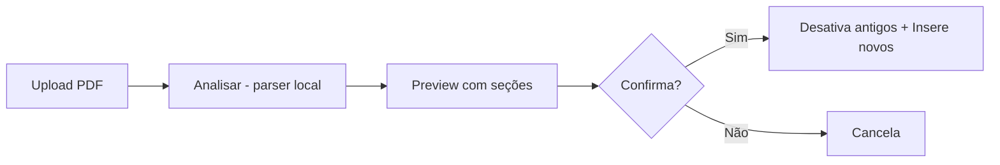
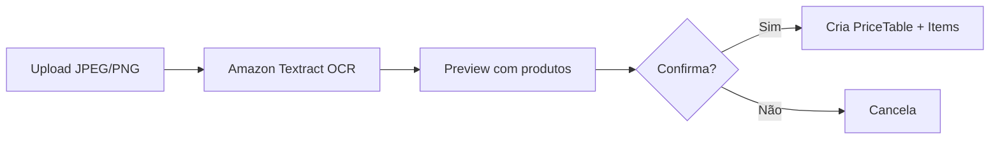

# Importadores de Tabelas

O backoffice tem importadores automáticos para as tabelas que a Major envia periodicamente.

## Importador de Tabela de Frete (PDF)

Extrai dados diretamente de PDFs estruturados das tabelas de frete da Major.

### Acesso

Backoffice → **Gerenciamento → Tabelas de Frete → Importar PDF**

URL: https://tepvendas.tecnoepec.com.br/management/freight-tables/import

### Fluxo



### Tecnologia

- Biblioteca: **UglyToad.PdfPig** (.NET)
- Detecta GO (SAME_STATE = 2) vs OE (EXTERNAL_STATE = 1) pelo título do PDF
- Parseia seções por tonelagem (`FRETE (14 TON)`, `FRETE (28 TON)`, etc.)
- Extrai faixas de distância (`De 1 a 50 KM`)
- 8 colunas de condições de pagamento

### Endpoints

| Método | Path | Descrição |
|--------|------|-----------|
| `POST` | `/tepsales/v1/freightTables/import/preview` | Parseia PDF, retorna preview (não salva) |
| `POST` | `/tepsales/v1/freightTables/import?deactivateExisting=true` | Importa e desativa antigos |

### Mapeamento de tonelagem

| PDF | Banco (VehicleType) |
|-----|---------------------|
| 14 TON | VT-014 |
| 12 TON | VT-018 (mapeado) |
| 18 TON | VT-018 |
| 28 TON | VT-028 |
| 32 TON | VT-032 |
| 38 TON | VT-038 |
| 50 TON | VT-050 |

### Volume típico

- **GO:** 448 registros (6 veículos × 9 faixas × 8 condições)
- **OE:** 640 registros (5 veículos × 16 faixas × 8 condições)

## Importador de Tabela de Preços (Imagem OCR)

Extrai dados de imagens (JPEG/PNG) das tabelas de preços da Major usando OCR.

### Acesso

Backoffice → **Gerenciamento → Tabelas de Preço → Importar OCR**

URL: https://tepvendas.tecnoepec.com.br/management/price-tables/import

### Fluxo



### Tecnologia

- OCR: **Amazon Textract** (`AnalyzeDocument` com `FeatureTypes=[TABLES]`)
- Custo: ~$0.015 por imagem (~R$0.10)
- Detecta GO vs Outras UFs pelo conteúdo
- Faz fuzzy match dos nomes de produtos contra a tabela `products`

### Endpoints

| Método | Path | Descrição |
|--------|------|-----------|
| `POST` | `/tepsales/v1/priceTables/import/preview` | OCR da imagem, retorna preview |
| `POST` | `/tepsales/v1/priceTables/import?deactivateExisting=true` | OCR + desativa antigos + insere |

### Estrutura criada no banco

```
PriceTable (GO ou OE)
  └── PaymentPriceTable (uma por condição de pagamento)
        └── PriceTableItem (uma por produto + valor)
```

### IAM

A task role `development-tepvendas-task` tem a policy `textract-analyze`:

```json
{
  "Effect": "Allow",
  "Action": ["textract:AnalyzeDocument"],
  "Resource": "*"
}
```

### Cuidados com formato brasileiro

Os valores no PDF/imagem usam formato brasileiro:

- `1.928,00` = **R$ 1,928** (3 casas decimais, R$/kg)
- `16.775` = **R$ 16.775** (sem decimais, valor de Silo)

O parser detecta automaticamente:

- Se valor < 50 e tem ponto → decimal (R$/kg)
- Se valor > 100 → preço por unidade (Silos)

### Produtos não encontrados

Se um produto da imagem não bater com nenhum nome na tabela `products`, ele é listado em `productsUnmatched` na resposta. Para resolver:

1. Verificar se o produto existe no cadastro
2. Renomear o produto para bater com o que vem da imagem, ou
3. Cadastrar o produto antes de reimportar

## Histórico de mudanças

- **abr/2026** — Criados ambos importadores (frete PDF + preços OCR)
- **abr/2026** — Correção de valores: itens em `price_table_items` foram divididos por 1000 porque o import inicial interpretou `1.928,00` como 1928.00 em vez de 1.928

## Próximos passos (sugestões)

- **Histórico de imports** — tabela `freight_table_imports` / `price_table_imports` com data, usuário, arquivo
- **Backup do arquivo** — salvar PDF/imagem original em S3 antes de processar
- **Notificação para a Major** — confirmar recebimento da tabela por e-mail/WhatsApp
- **Validação anti-duplicata** — hash do conteúdo para detectar reimport idêntico
